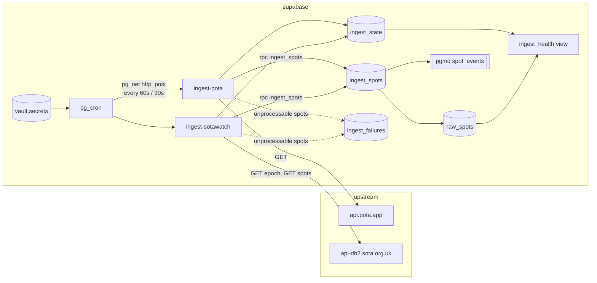
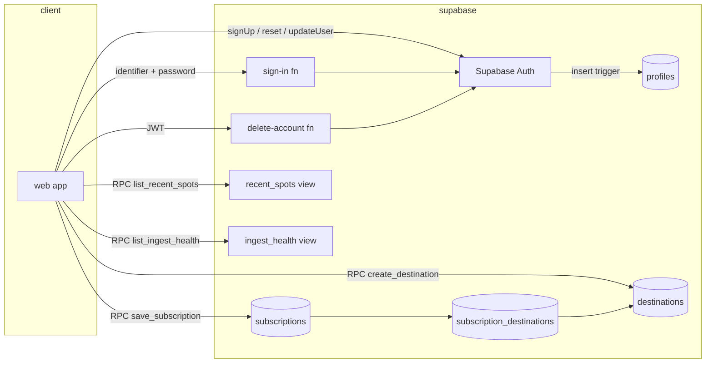
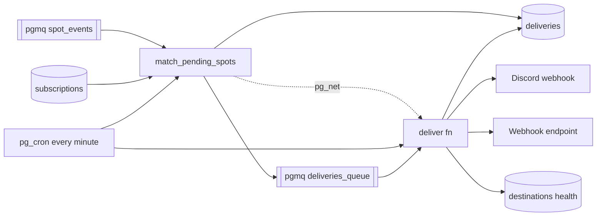
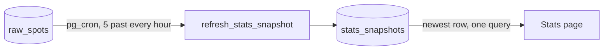

# Architecture (Phase 1)

## Flow

Both Edge Functions share one orchestrator (`supabase/functions/_shared/ingest.ts`) and differ
only in their source adapter (`pota.ts`, `sotawatch.ts`). A run:

1. SOTAwatch only: fetch the epoch token and compare with `ingest_state.last_epoch`. Unchanged
   means nothing new; record the run and return.
2. Fetch the feed with a `LongLines/0.1 (+<project url>)` User-Agent and a 10 s timeout.
3. Normalize each spot. Spots older than five minutes, test spots, and non-NORMAL SOTAwatch spots
   are skipped and counted. A spot that cannot be normalized (missing callsign, bad frequency) is
   collected for `ingest_failures`; it never aborts the run.
4. Call `ingest_spots(jsonb)` once with the whole batch.
5. Write the dead letters, then `record_ingest_success`. Any failure outside per-spot handling
   calls `record_ingest_failure` and returns a 500 so it shows up in function logs.

The function response body is the run summary (`fetched`, `inserted`, `skipped`, `failed`).

## Why the schema looks like this

`raw_spots` is a raw firehose: one row per source observation, no cross-source dedup. A station
spotted by both POTA and SOTAwatch is two rows. Downstream consumers decide what "the same spot"
means for their purpose; collapsing early would throw away information they may need.

Common fields are normalized (uppercase callsigns, kHz frequencies, lowercase modes, derived
`band` and `mode_family`) so consumers do not re-implement each source's quirks. Source-specific fields keep their
own nullable columns rather than a generic JSON blob, and `raw_payload` keeps the original record
for debugging and replay.

All timestamps are `timestamptz`. POTA sends spot times without an offset; they are UTC and the
normalizer appends `Z` before parsing.

## How dedup works

Each spot is hashed (sha256) over the upstream fields that can change after publication, in a
fixed order:

- POTA: `spotTime, activator, reference, frequency, mode, comments`
- SOTAwatch: `timeStamp, activatorCallsign, summitCode, frequency, mode, comments`

The unique constraint `(source, source_spot_id, content_hash)` plus `INSERT ... ON CONFLICT DO
NOTHING RETURNING` does the rest: re-fetching an unchanged spot inserts nothing, and an edited
spot (new hash) lands as a new row. No existence check is needed before inserting, and the
RETURNING rows are exactly the new ones.

## Why insert and enqueue are one RPC

supabase-js cannot call `pgmq` directly: the schema is not exposed through PostgREST, and the
`pgmq_public` wrappers only exist when toggled on in the dashboard. `public.ingest_spots` wraps
the insert and `pgmq.send_batch` in one transaction, so a spot can never be stored without its
queue message, and the function makes one round trip for the whole batch.

## Why the queue is primed with no consumer

`spot_events` carries `{"spot_id", "source"}` for every new row. Nothing reads it in Phase 1.
Priming it now means the ingest path is already producing the contract later phases will consume,
and `pgmq.metrics('spot_events')` doubles as a check that the insert path is live.

## Why Vault for the cron credentials

The cron jobs call the functions over HTTP with the service-role key. The URL and key live in
Supabase Vault (`vault.decrypted_secrets`), encrypted at rest, created once by
`scripts/setup-db-settings.sql`. Migrations never contain them.

## Scheduling

pg_cron on Supabase accepts `"30 seconds"` as a schedule, so SOTAwatch is a single sub-minute
job. POTA runs on the standard `* * * * *`.

## Access

There is no RLS and no user-facing API in Phase 1. The tables, view and RPCs have their default
PostgREST grants revoked from `anon` and `authenticated`, so only the service role (and the
`postgres` user in Studio) can read or write them.

# Phase 2: accounts, destinations, subscriptions

## Accounts

Supabase Auth owns credentials. `profiles` holds the callsign, name and display
preferences and is created by a trigger on `auth.users` from the sign-up
metadata; a bad or taken callsign makes the trigger raise, so the sign-up
fails instead of leaving a user without a profile. `callsign_available()` is
the only anonymous RPC and reveals nothing but a boolean.

Signing in with a callsign goes through the `sign-in` Edge Function. It resolves
the callsign to an email with a service-role-only SQL function, calls
`signInWithPassword` server side, and returns the session tokens. The error
message is the same for an unknown identifier and a wrong password, unknown
identifiers still pay for a password check, and attempts are logged in
`sign_in_attempts` so the eleventh attempt per identifier in fifteen minutes is
refused.

## Destinations

A Discord webhook URL is a credential. `destinations.url` and
`destinations.signing_secret` are omitted from the column grant, so no client
query can read them; `create_destination()` validates the URL, stores the
masked `url_display`, and returns the signing secret exactly once.
`rotate_signing_secret()` issues a replacement.

URL rules, enforced in SQL and repeated by the delivery worker: https only;
Discord hosts must be `discord.com` or `discordapp.com` with an
`/api/webhooks/` path; webhook hosts may not be `localhost` or an IP literal in
a private, loopback, link-local, CGNAT, unspecified or IPv4-mapped range.

## Subscriptions

`save_subscription(jsonb)` writes the subscription and replaces its destination
links in one transaction and refuses destinations the caller does not own.
`subscription_destinations.destination_id` is `on delete restrict`, which is
what makes a destination in use undeletable. Filters are arrays where empty
means "any"; modes are stored lowercase and callsigns uppercase.

A mode filter value matches either `raw_spots.mode` or `raw_spots.mode_family` (`cw`, `phone`,
`digital`). The family is derived at ingest by `supabase/functions/_shared/modes.ts`, the only
place that decides what a mode string means; SQL just compares strings. This exists because
SOTAwatch's spot form offers a single `DATA` label for every digital mode, so a filter on `ft8`
alone would never see a SOTA digital activation; `digital` catches both. When upstream sends a
blank or generic digital mode and the comment names a specific one ("FT8 QRP"), the specific
mode is stored, the same way the RBNHole spotter is read from the comment.

## Deleting an account

`delete-account` removes the `auth.users` row and everything cascades. Because
`subscription_destinations.destination_id` is `on delete restrict`, a
`before delete` trigger on `auth.users` first deletes the user's subscriptions
so the restrict rule, which exists to protect destinations still in use, does
not block the cascade.

## What clients can read

- `recent_spots`: the last 24 hours of `raw_spots` without `raw_payload`, read through the
  `list_recent_spots(max_rows)` RPC (the table itself stays unreadable).
- `ingest_health`: read through the `list_ingest_health()` RPC so the Sources page can show it.
- Both views are invoker views that clients cannot select directly; the security definer RPCs
  are the client path. Supabase's security linter flags definer views in an exposed schema, so
  don't turn either back into one.
- Their own `profiles`, `destinations` (safe columns), `subscriptions` and
  links, through RLS.
- `stats_snapshots`: hourly jsonb summaries of the last 7 complete UTC days, written only by
  cron (`refresh_stats_snapshot`). Anyone can read every row, signed in or not: the Stats page
  is public and the payload is aggregated from already-public spot feeds.

`deliveries`, `subscription_quiet` and `sign_in_attempts` are service-role only.

# Phase 2: matching and delivery

## Matcher

`match_pending_spots()` is a Postgres function because matching is a join:
one batch of `spot_events` against every enabled subscription through
`spot_matches(subscription, spot)`, the single predicate the preview uses too.
In one transaction it reads up to 500 events (60 s visibility), applies each
subscription's quiet window (`subscription_quiet` remembers the last send per
callsign; within a batch only the earliest spot per callsign is eligible),
inserts one `deliveries` row per (destination, spot) with `on conflict do
nothing` so two subscriptions sharing a destination deliver once, queues the
new delivery ids, archives the events, and pokes the `deliver` function over
pg_net when it created anything. It runs after every successful ingest and on
a one-minute cron as a safety net.

## Delivery worker

`deliver` claims up to 200 messages through `claim_deliveries()` (which joins
in the spot and the destination, secrets included, and archives orphans),
drops anything older than 24 hours, groups by destination, skips paused
destinations, and sends: Discord as embeds, ten per message and at most 30
messages per webhook per run, honoring `429 retry_after`; webhooks as signed
JSON, fifty spots per request, 10 s timeout. Every outcome goes back through an
RPC so the delivery rows, the queue messages and the destination's health
change together: `mark_deliveries_sent`, `mark_deliveries_failed` (backoff via
`pgmq.set_vt`, five in a row marks the destination failing), `delay_deliveries`
(rate limited, not a failure) and `mark_deliveries_dropped`.

Outbound URL safety is checked twice: in SQL when the destination is created
and in the worker before each request, which also resolves the hostname and
refuses private addresses so a DNS change after creation cannot turn a
webhook into an internal request. Redirects are never followed, and if the
runtime cannot resolve DNS the worker refuses to send rather than guess. What
remains is the window between resolving and connecting (classic rebinding),
which `fetch` cannot close without a custom dialer; the DNS check, the private
range refusal and the 10 s timeout keep that window small.

`send-test` reuses the same formatting and sending code for one labeled
sample spot.

# Phase 3: stats snapshot

The Stats page is a fixed dashboard of the seven most recent complete UTC days: midnight UTC seven
days ago up to, but not including, midnight UTC today, filtered on `spot_time`. Nothing on it is
adjustable, so the whole page is one precomputed JSON document.

## Why a snapshot table

The payload is a dozen aggregates over a week of spots (totals, per-day and per-band counts, a
per-state choropleth, mode shares, top activators and references, plus activation and chaser
counts beside every spot count). Computing it on every page view
would scan `raw_spots`, which clients cannot read anyway. Instead `refresh_stats_snapshot()`, a
security-definer plpgsql function, builds the payload in one `insert … with … select` and runs
from pg_cron at five past every hour. The web app selects the newest row by `generated_at`, caches
it for the browser session and never polls. The table keeps the 48 most recent rows (two days); the
refresh prunes older ones.

## Counting rules

- Every `raw_spots` row is one spot. A station spotted by both sources counts twice; callsigns are
  counted exactly as stored (`/P` and the like are kept). A spot is one report, not a contact: a
  busy activation is re-spotted many times, so spot counts run far ahead of operating activity.
- An activation is one distinct (callsign, reference, UTC day), per program. Only spotted
  activations are visible and no QSO count is known, so this is a floor on the programs' own
  numbers. The totals and both top-8 tables carry it next to the spot count.
- A chaser is a distinct spotter callsign, excluding null spotters and self-spots. A self-spot is
  one whose spotter equals any `/`-separated part of the activator callsign (`SQ1GPR` spotting
  `SQ1GPR/P`, `G4OBK` spotting `W4/G4OBK`). RBN skimmers are stored as plain callsigns and count.
- POTA state counts come from `pota_location`, a comma-separated list such as `US-NC,US-VA`; a park
  spanning two states counts once in each. Non-US entries and territories are ignored and all 51
  codes (50 states and DC) are always present, zero-filled.
- SOTA associations are the part of `sota_summit_ref` before the `/`.
- Bands use a fixed order (`80m` through `2m`); other bands are excluded from the band charts only.
- Modes collapse to CW, SSB (`ssb`, `usb`, `lsb`), FT8/FT4, FM and Other (including null) as
  integer percentages that sum to exactly 100; the rounding remainder goes to the largest bucket.
- Window arithmetic is done on `now() at time zone 'utc'` so a session time zone with DST cannot
  shift the window by an hour.

The payload's TypeScript shape is `StatsPayload` in `web/src/stats/types.ts`; the pgTAP suite
`supabase/tests/stats_snapshot.test.sql` pins both the shape and the numbers.
