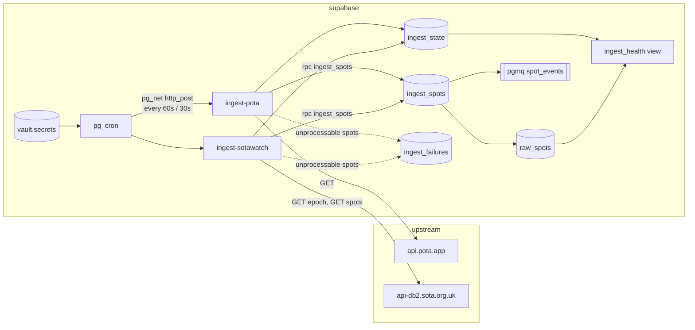

# Architecture (Phase 1)

## Flow

Both Edge Functions share one orchestrator (`supabase/functions/_shared/ingest.ts`) and differ
only in their source adapter (`pota.ts`, `sotawatch.ts`). A run:

1. SOTAwatch only: fetch the epoch token and compare with `ingest_state.last_epoch`. Unchanged
   means nothing new; record the run and return.
2. Fetch the feed with a `LongLines/0.1 (+<project url>)` User-Agent and a 10 s timeout.
3. Normalize each spot. Spots older than five minutes, test spots, and non-NORMAL SOTAwatch spots
   are skipped and counted. A spot that cannot be normalized (missing callsign, bad frequency) is
   collected for `ingest_failures`; it never aborts the run.
4. Call `ingest_spots(jsonb)` once with the whole batch.
5. Write the dead letters, then `record_ingest_success`. Any failure outside per-spot handling
   calls `record_ingest_failure` and returns a 500 so it shows up in function logs.

The function response body is the run summary (`fetched`, `inserted`, `skipped`, `failed`).

## Why the schema looks like this

`raw_spots` is a raw firehose: one row per source observation, no cross-source dedup. A station
spotted by both POTA and SOTAwatch is two rows. Downstream consumers decide what "the same spot"
means for their purpose; collapsing early would throw away information they may need.

Common fields are normalized (uppercase callsigns, kHz frequencies, lowercase modes, derived
`band`) so consumers do not re-implement each source's quirks. Source-specific fields keep their
own nullable columns rather than a generic JSON blob, and `raw_payload` keeps the original record
for debugging and replay.

All timestamps are `timestamptz`. POTA sends spot times without an offset; they are UTC and the
normalizer appends `Z` before parsing.

## How dedup works

Each spot is hashed (sha256) over the upstream fields that can change after publication, in a
fixed order:

- POTA: `spotTime, activator, reference, frequency, mode, comments`
- SOTAwatch: `timeStamp, activatorCallsign, summitCode, frequency, mode, comments`

The unique constraint `(source, source_spot_id, content_hash)` plus `INSERT ... ON CONFLICT DO
NOTHING RETURNING` does the rest: re-fetching an unchanged spot inserts nothing, and an edited
spot (new hash) lands as a new row. No existence check is needed before inserting, and the
RETURNING rows are exactly the new ones.

## Why insert and enqueue are one RPC

supabase-js cannot call `pgmq` directly: the schema is not exposed through PostgREST, and the
`pgmq_public` wrappers only exist when toggled on in the dashboard. `public.ingest_spots` wraps
the insert and `pgmq.send_batch` in one transaction, so a spot can never be stored without its
queue message, and the function makes one round trip for the whole batch.

## Why the queue is primed with no consumer

`spot_events` carries `{"spot_id", "source"}` for every new row. Nothing reads it in Phase 1.
Priming it now means the ingest path is already producing the contract later phases will consume,
and `pgmq.metrics('spot_events')` doubles as a check that the insert path is live.

## Why Vault for the cron credentials

The cron jobs call the functions over HTTP with the service-role key. The URL and key live in
Supabase Vault (`vault.decrypted_secrets`), encrypted at rest, created once by
`scripts/setup-db-settings.sql`. Migrations never contain them.

## Scheduling

pg_cron on Supabase accepts `"30 seconds"` as a schedule, so SOTAwatch is a single sub-minute
job. POTA runs on the standard `* * * * *`.

## Access

There is no RLS and no user-facing API in Phase 1. The tables, view and RPCs have their default
PostgREST grants revoked from `anon` and `authenticated`, so only the service role (and the
`postgres` user in Studio) can read or write them.
